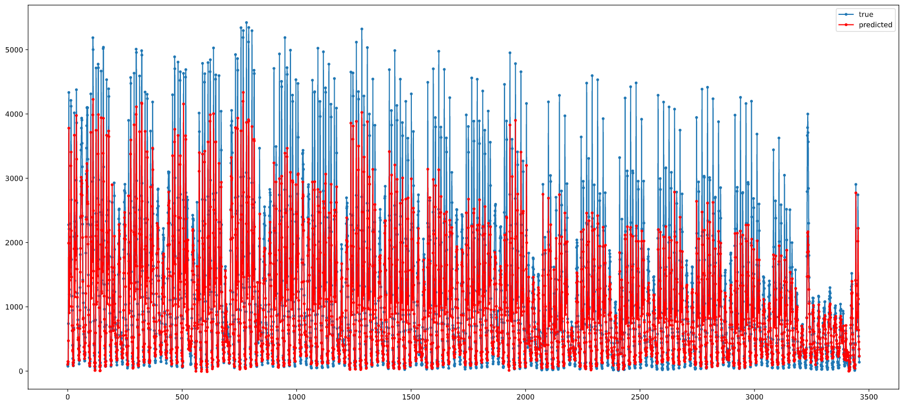
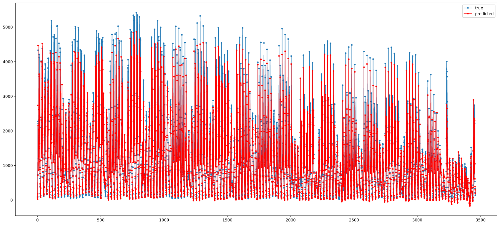

# Time Series Forecasting Bike Sharing
Using the london bike sharing dataset to learn about time series forecasting.  

### Data Visualisation
By looking at the data it is obvious that the number of bike shares is greater during the summer months. Also the plot aginst the hourly data has 2 peaks at morning and evening possibly due to work/school. Though during holidays the numbers are greater during the afternoon. The numbers also fall during the weekends. This needs to be taken into account when building the model.  

The basic bi LSTM gave a val loss of 0.0448. This can be improved by just increasing the number of epochs.  
 

    

 

Though on adding another LSTM layer and increasing the epochs to 50 the val loss reduced to 0.0307.  
 

    

   

Increasing the epochs and maybe adding another LSTM layer will improve performance even more.